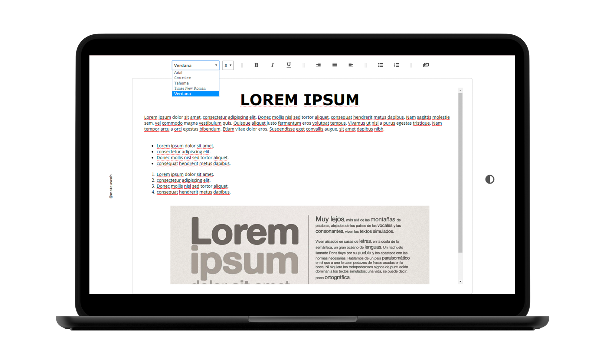

<h1 align="center">
    RICHTEXT EDITOR
</h1>

  <a href="#-project">Project</a>

 

  

## 💻 Project

Responsive Rich Text editor with "DARK" mode, very simple, developed to zero in Javascript.

### DARK MODE

### MOBILE

